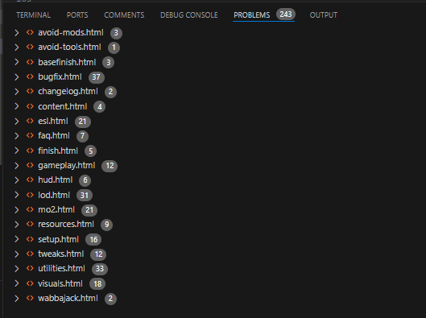

# [The Midnight Ride](https://themidnightride.moddinglinked.com/)

[](https://github.com/h5bp/html5-boilerplate/blob/master/LICENSE.txt)

## A Comprehensive Fallout 4 Modding Guide

The Midnight Ride is a modding guide for Fallout 4 that will carefully walk you through how to install all the mods you will need for a perfectly stable, smooth and enjoyable experience. The guide is highly accessible for everyone, no matter your modding experience. It is still incredibly important that you read all the instructions very carefully, even if you believe you are experienced enough to skip them. There are many small instructions that are vital for your game to function, and could be easily missed if you aren't careful. Although you don't need any modding experience to use this guide, it is expected for you to be relatively experienced with operating a computer in general

## Fork Changes

This fork retains the original content while implementing some enhancements to the CSS, JavaScript, and HTML structure.

### CSS

- Rebuilt from the ground up using a Mobile-First Design approach, reducing CSS size from 900 styles to less than 500.
- Utilized Node for SASS, PostCSS, Autoprefixer, and CSSNano to optimize performance further.

### JavaScript

- Eliminated the Resize event listener and related functions, favoring a purely CSS-based approach.
- Simplified the drawer function from 9 lines of code to just 3.
- Removed redundant functions and introduced new automation features:
  - Enhanced page detection for Base/TMRE Extended pages, enabling exclusive styling that can be accessed on CSS.
  
  ```css
    html[tmre="true"] .someStyleHere {...}
  ```

  - Implemented automatic stylization for local links (any `<a>` with `#` in its href).
  - Converted the Left Sidebar, Right Side Nav (Table of Contents), and Arrow Navigation into custom components with automated functionality.

### HTML

I'm using [HTML-validate](https://html-validate.org/) to pinpoint some HTML related problem and oh boy.



Anyway, the fixes:

- **Major Fixes**: Completely resolves HTML problems from `/intro` to `/utilities`, ensuring compliance with HTML standards.
- **Minor Fixes**: Only resolves critical issues and refactored elements for compatibility with the new CSS styling for all of `Base` and `Extended` HTML.
